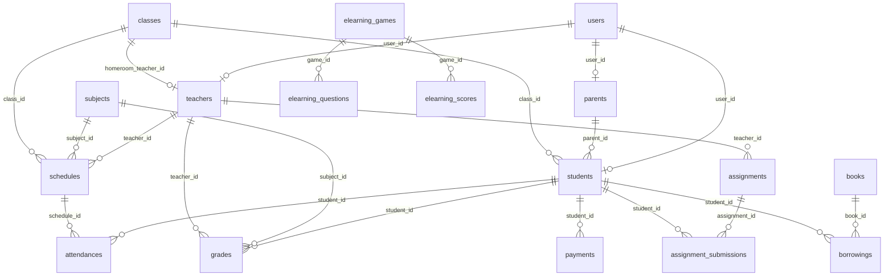

# Pemetaan Halaman Web (URL) & Tabel Database PostgreSQL
## SMP Darul Ulum Surabaya — School Information System & E-Learning Portal

Dokumen ini memetakan seluruh rute halaman web (URL), fitur, serta tabel basis data PostgreSQL (Prisma ORM) yang terhubung untuk setiap peran pengguna (*User Role*).

---

## 1. ADMIN (Pengelola Sistem & Akademik)

| Rute Halaman (URL) | Nama Fitur / Modul | Tabel Database PostgreSQL | Keterangan & Relasi |
| :--- | :--- | :--- | :--- |
| `/admin` | Dashboard Utama Admin | `users`, `students`, `teachers`, `payments`, `admissions`, `audit_logs` | Ringkasan statistik pengguna, keuangan, PPDB, dan log aktivitas |
| `/admin/akademik/kelas` | Manajemen Kelas & Wali Kelas | `classes`, `teachers`, `students` | Pengelolaan rombel kelas, kapasitas, dan penatapan Wali Kelas |
| `/admin/akademik/mapel` | Manajemen Mata Pelajaran | `subjects` | Pengelolaan kurikulum mapel umum & muatan lokal keislaman |
| `/admin/akademik/jadwal` | Penataan Jadwal Mengajar | `schedules`, `classes`, `teachers`, `subjects` | Penyesuaian jam mengajar otomatis 1 semester bebas bentrok |
| `/admin/pengguna/siswa` | Data Siswa & Santri | `students`, `users`, `classes`, `parents` | Pengelolaan data induk siswa, NISN, status, dan akun login |
| `/admin/pengguna/guru` | Data Guru & Staf | `teachers`, `users` | Pengelolaan data pendidik, NIP, mata pelajaran utama, dan akun |
| `/admin/ppdb` | Pendaftaran PPDB Online | `admissions` | Verifikasi berkas calon siswa, status seleksi, dan nomor pendaftaran |
| `/admin/keuangan` | Keuangan & SPP Siswa | `payments`, `students` | Pengelolaan tagihan SPP, metode pembayaran (QRIS/Transfer/Tunai) |
| `/admin/laporan` | Laporan Rekapitulasi | `grades`, `attendances`, `payments`, `admissions` | Grafik rekapitulasi nilai, kehadiran, keuangan, dan pendaftaran |
| `/admin/konten/berita` | Kelola Berita Sekolah | `news` | Pembuatan & publikasi artikel berita sekolah |
| `/admin/konten/pengumuman` | Kelola Pengumuman | `announcements` | Pengumuman internal dan publik tersemat (*pinned*) |
| `/admin/konten/agenda` | Kelola Kalender Kegiatan | `events` | Kalender agenda sekolah, tanggal mulai/selesai, dan lokasi |
| `/admin/konten/galeri` | Kelola Galeri Foto & Video | `gallery_albums`, `gallery_items` | Album media dokumentasi kegiatan sekolah |
| `/admin/konten/prestasi` | Kelola Prestasi Siswa | `achievements` | Catatan kejuaraan & penghargaan siswa/sekolah |
| `/admin/konten/download` | Kelola Berkas Unduhan | `downloads` | Upload & manajemen formulir atau dokumen publik (PDF/Doc) |
| `/admin/perpustakaan` | Perpustakaan Digital Admin | `books`, `borrowings`, `students` | Katalog buku, stok, dan pencatatan sirkulasi peminjaman |
| `/admin/log` | Audit Log System Tracker | `audit_logs`, `users` | Jejak rekam aktivitas pengguna, IP address, dan tipe aksi |
| `/admin/pengaturan` | Pengaturan Web & Tahun Ajaran | `site_settings`, `academic_years` | Konfigurasi profil sekolah, tahun ajaran aktif, dan semester |

---

## 2. GURU (Tenaga Pendidik)

| Rute Halaman (URL) | Nama Fitur / Modul | Tabel Database PostgreSQL | Keterangan & Relasi |
| :--- | :--- | :--- | :--- |
| `/guru` | Dashboard Guru | `teachers`, `schedules`, `assignments`, `materials` | Ringkasan jadwal mengajar hari ini, tugas aktif, & kelas ajar |
| `/guru/jadwal` | Jadwal Mengajar Guru | `schedules`, `classes`, `subjects` | Jam mengajar mingguan per kelas dan ruangan |
| `/guru/akademik/nilai` | Input Nilai Rapor Siswa | `grades`, `students`, `subjects`, `academic_years` | Penginputan nilai tugas, ulangan harian, PTS, dan PAS |
| `/guru/akademik/absensi` | Presensi Kehadiran Kelas | `attendances`, `students`, `schedules`, `classes` | Pencatatan status sapa/hadir/izin/sakit/alfa siswa |
| `/guru/akademik/tugas` | Kelola Tugas & PR Siswa | `assignments`, `assignment_submissions`, `subjects` | Pembuatan tugas, pengumpulan file siswa, dan koreksi nilai |
| `/guru/akademik/materi` | Kelola Bahan Ajar & Modul | `materials`, `subjects` | Upload bahan ajar digital (PDF, Video, Link External) |
| `/guru/elearning` | Master Game Studio & Quizizz | `elearning_games`, `elearning_questions`, `elearning_scores` | Pembuatan bank soal kuis, statistik dimainkan, dan Quizizz Live |

---

## 3. SISWA (Peserta Didik)

| Rute Halaman (URL) | Nama Fitur / Modul | Tabel Database PostgreSQL | Keterangan & Relasi |
| :--- | :--- | :--- | :--- |
| `/siswa` | Dashboard Siswa | `students`, `classes`, `schedules`, `assignments` | Ringkasan tugas mendatang, jadwal hari ini, & nilai terbaru |
| `/siswa/jadwal` | Jadwal Pelajaran Kelas | `schedules`, `subjects`, `teachers`, `classes` | Daftar mata pelajaran mingguan dan guru pengampu |
| `/siswa/nilai` | Nilai & Hasil Belajar | `grades`, `subjects`, `teachers` | Transkrip nilai per mata pelajaran dan semester |
| `/siswa/absensi` | Rekap Absensi Saya | `attendances`, `schedules` | Riwayat kehadiran siswa di kelas |
| `/siswa/tugas` | Daftar Tugas & PR | `assignments`, `assignment_submissions` | Pengumpulan jawaban tugas dan feedback nilai dari guru |
| `/siswa/materi` | Download Materi Belajar | `materials`, `subjects` | Unduh bahan ajar modul & video materi pelajaran |
| `/siswa/elearning` | Arena E-Learning Interaktif | `elearning_games`, `elearning_scores` | Katalog 8 game edukasi interaktif & leaderboard skor |
| `/siswa/elearning/game/quizizz` | Quizizz Live Arena | `elearning_games`, `elearning_questions`, `elearning_scores` | Arena kuis real-time dengan PIN room & QR Code |
| `/siswa/elearning/game/matematika` | Game Math Blitz | `elearning_games`, `elearning_questions`, `elearning_scores` | Kuis matematika hitung cepat berbatas waktu |
| `/siswa/elearning/game/tajwid` | Game Tajwid & PAI Quest | `elearning_games`, `elearning_questions`, `elearning_scores` | Game hukum bacaan Al-Qur’an & agama Islam |
| `/siswa/elearning/game/vocab` | Game Word Concept Match | `elearning_games`, `elearning_questions`, `elearning_scores` | Match istilah sains & definisi kosakata |
| `/siswa/elearning/game/scramble` | Game Word Scramble | `elearning_games`, `elearning_questions`, `elearning_scores` | Permainan susun huruf kosakata bahasa Inggris |
| `/siswa/elearning/game/memory` | Game IPA Memory Match | `elearning_games`, `elearning_questions`, `elearning_scores` | Pencocokan kartu memori istilah biologi/fisika |
| `/siswa/elearning/game/quiz-ipa` | Game Science Quiz | `elearning_games`, `elearning_questions`, `elearning_scores` | Kuis sains IPA interaktif disertai penjelasan |
| `/siswa/elearning/game/timeline` | Game Sejarah Timeline | `elearning_games`, `elearning_questions`, `elearning_scores` | Permainan mengurutkan garis waktu sejarah Indonesia |
| `/siswa/rapor` | Rapor Digital Siswa | `grades`, `students`, `academic_years` | Tampilan & cetak rapor semester siswa |
| `/siswa/kartu` | Cetak Kartu Pelajar QR Code | `students`, `student_qr_codes` | Generasi & cetak kartu identitas siswa dengan QR Code |

---

## 4. ORANG TUA (Wali Siswa)

| Rute Halaman (URL) | Nama Fitur / Modul | Tabel Database PostgreSQL | Keterangan & Relasi |
| :--- | :--- | :--- | :--- |
| `/ortu` | Dashboard Orang Tua | `parents`, `students`, `grades`, `attendances`, `payments` | Monitoring perkembangan belajar, absensi, & SPP anak |
| `/ortu/nilai` | Rapor & Nilai Anak | `grades`, `students`, `subjects` | Transkrip hasil belajar dan nilai ujian anak |
| `/ortu/absensi` | Kehadiran Anak | `attendances`, `students` | Rekapitulasi persentase kehadiran anak di sekolah |
| `/ortu/pembayaran` | Pembayaran SPP & Biaya | `payments`, `students` | Tagihan SPP bulan ini, status lunas/pending, & bukti bayar |

---

## 5. HALAMAN PUBLIK (Website Utama)

| Rute Halaman (URL) | Nama Fitur / Modul | Tabel Database PostgreSQL | Keterangan & Relasi |
| :--- | :--- | :--- | :--- |
| `/` | Beranda Portal Utama | `news`, `events`, `announcements`, `achievements`, `site_settings` | Landing page sekolah, sambutan Kepala Sekolah, & slider media |
| `/profil` | Profil & Visi Misi | `site_settings` | Sejarah sekolah, struktur organisasi, & visi misi |
| `/berita` | Berita & Kabar Sekolah | `news` | Daftar berita terbaru sekolah |
| `/pengumuman` | Informasi Pengumuman | `announcements` | Informasi resmi publik |
| `/agenda` | Agenda & Kalender | `events` | Jadwal kegiatan mendatang |
| `/galeri` | Galeri Dokumentasi | `gallery_albums`, `gallery_items` | Foto & video kegiatan siswa |
| `/prestasi` | Prestasi Sekolah | `achievements` | Daftar kejuaraan & penghargaan |
| `/ppdb` | Informasi PPDB Online | `admissions`, `site_settings` | Panduan pendaftaran siswa baru |
| `/perpustakaan` | Katalog Perpustakaan | `books` | Pencarian buku pustaka sekolah |
| `/kontak` | Kontak & Lokasi | `site_settings` | Alamat, peta Google Maps, & formulir kontak |

---

## 6. Ringkasan Relasi Basis Data (PostgreSQL Schema)

